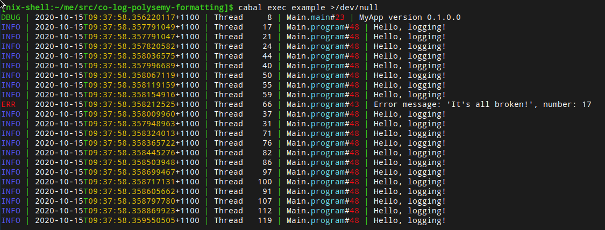

# co-log-polysemy-formatting  

co-log-polysemy-formatting gives you a Polysemy logging effect for high quality (unstructured) logs.

It does this by tying together several excellent packages:

- [co-log],
- [co-log-polysemy], and
- [formatting].

To get started, see [the haddock documentation](https://hackage.haskell.org/package/co-log-polysemy-formatting-0.1.0.0/docs/Colog-Polysemy-Formatting.html).

## Output format

The output format is customisable, but by default it includes:

- The message severity,
- a message timestamp, with nanosecond accuracy,
- a thread Id,
- a source location, and
- your log message, formatted using [formatting].

The colours show up if your terminal supports them, otherwise it will fall back to greyscale, including if you pipe the output to a file.

## formatting messages

Our logging functions, e.g. `logInfo`, take a [formatting] formatter rather than a `String`/`Text`/etc.
This makes it quick and easy to build your log messages from whatever type you have at hand, and still allows you to directly log string literals thanks to the `OverloadedStrings` language extension.

## Why not just use co-log-polysemy?

[co-log-polysemy] is a generic logging effect that leaves many decisions up to you, such as your logging format and your logging message type.
But if you want something that just works, with good defaults, then co-log-polysemy-formatting will get you there faster.
And you're still using co-log-polysemy under the hood -- we even re-export some of its functions for you -- we've just added a few features on top.

[co-log]: https://hackage.haskell.org/package/co-log
[co-log-polysemy]: https://hackage.haskell.org/package/co-log-polysemy
[formatting]: https://hackage.haskell.org/package/formatting
